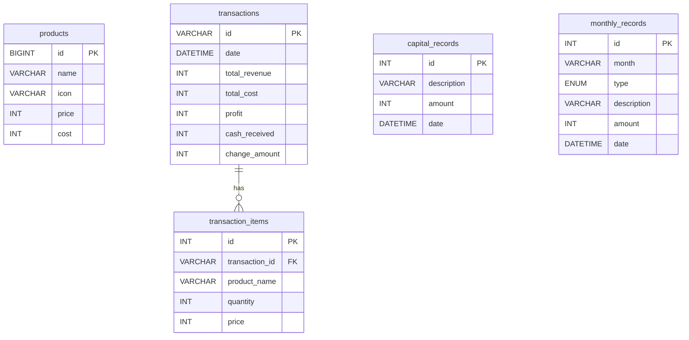

# Dokumentasi Sistem Kasir Pintar (Point of Sale)

Dokumen ini berisi dokumentasi teknis menyeluruh mengenai aplikasi **Kasir Pintar** berbasis web yang dikembangkan menggunakan PHP, MySQL, JavaScript, dan CSS modern. Dokumen ini menjelaskan arsitektur perangkat lunak, skema database, basis perhitungan matematis pada sistem, serta panduan alur kerja aplikasi secara mendalam.

---

## 1. Arsitektur Perangkat Lunak

Sistem Kasir Pintar dibangun dengan mematuhi prinsip **Clean Architecture** (Arsitektur Bersih). Hal ini dilakukan untuk memisahkan antara aturan bisnis utama (domain logic), pengendali alur kerja (use cases), penengah data (interface adapters), dan antarmuka luar (frameworks & drivers). 

### Pembagian Layer (Lapisan)
1. **Domain Layer (Entities):** Aturan bisnis mendasar seperti struktur data `Product`, `CartItem`, dan `Transaction`. Layer ini murni berisi logika bisnis yang bebas dari dependensi framework atau database.
2. **Application Layer (Use Cases):** Logika fungsional aplikasi, misalnya memproses item ke keranjang belanja (`CartState`), menghitung total transaksi, dan memvalidasi kelayakan nominal pembayaran tunai.
3. **Interface Adapters:** Jembatan komunikasi antara logika frontend dan backend. Diimplementasikan melalui kelas `ApiRepository` yang melayani pertukaran data AJAX (menggunakan metode asinkronus `fetch`) dengan server. Di sisi backend, file `api.php` bertindak sebagai adapter pengubah query MySQL menjadi format data JSON.
4. **Frameworks & Drivers (UI & Data Layer):** Antarmuka pengguna (HTML5, Vanilla CSS, dan manipulasi DOM di `index.php`) serta penyimpanan data permanen (server basis data MySQL melalui driver `mysqli` PHP).

### Alur Komunikasi Client-Server
Aplikasi berjalan sebagai **Single Page Application (SPA)** untuk memaksimalkan kecepatan interaksi pengguna di kasir:
* Antarmuka utama (`index.php`) memuat halaman awal dan memanggil fungsi JavaScript secara asinkronus.
* Frontend berkomunikasi dengan backend REST API (`api.php`) via request HTTP (`GET` untuk penarikan data, `POST` untuk penyimpanan data baru).
* Sisi server (`api.php`) berinteraksi secara aman dengan database MySQL (`database.php`) menggunakan prepared statements, kemudian mengembalikan respons terstruktur berformat JSON.

---

## 2. Skema Basis Data (Database Schema)

Sistem menggunakan database bernama `pos_kasir` yang terdiri dari 5 tabel terelasi untuk memastikan konsistensi dan integritas data transaksi.



### Detail Tabel

#### A. Tabel `products`
Menyimpan informasi menu hidangan atau barang dagangan yang terdaftar.
* `id` (BIGINT, Primary Key): Pengidentifikasi unik produk berbasis UNIX timestamp.
* `name` (VARCHAR 255): Nama produk yang dijual.
* `icon` (VARCHAR 255): Path penyimpanan lokal gambar di folder `uploads/` atau tautan gambar eksternal.
* `price` (INT): Harga jual eceran produk kepada pelanggan.
* `cost` (INT): Harga modal awal (biaya produksi/belanja grosir per unit) untuk keperluan perhitungan laba bersih.

#### B. Tabel `transactions`
Menyimpan ringkasan transaksi belanja utama secara agregat.
* `id` (VARCHAR 50, Primary Key): Kode unik transaksi dengan format `TRX-[Timestamp]`.
* `date` (DATETIME): Tanggal dan waktu transaksi diselesaikan di mesin kasir.
* `total_revenue` (INT): Total omset kotor belanjaan pelanggan.
* `total_cost` (INT): Total pengeluaran modal produksi untuk transaksi tersebut.
* `profit` (INT): Laba bersih dari transaksi.
* `cash_received` (INT): Nominal uang tunai fisik yang diserahkan pelanggan.
* `change_amount` (INT): Nominal uang kembalian yang harus diserahkan kepada pelanggan.

#### C. Tabel `transaction_items`
Menyimpan detail item barang yang dibeli per transaksi (relasi *One-to-Many* terhadap tabel `transactions`).
* `id` (INT, Auto Increment, Primary Key): ID baris unik.
* `transaction_id` (VARCHAR 50, Foreign Key): Terhubung ke `transactions.id` dengan relasi `ON DELETE CASCADE`.
* `product_name` (VARCHAR 255): Nama produk saat transaksi diselesaikan (mencegah perubahan nama produk di masa depan merusak data transaksi historis).
* `quantity` (INT): Jumlah barang yang dibeli.
* `price` (INT): Harga jual per unit saat transaksi berlangsung.

#### D. Tabel `capital_records`
Menyimpan catatan penanaman modal awal bisnis (untuk perhitungan balik modal/BEP).
* `id` (INT, Auto Increment, Primary Key): ID baris unik.
* `description` (VARCHAR 255): Keterangan alokasi modal (contoh: Sewa Tempat, Alat Espresso, Bahan Baku Awal).
* `amount` (INT): Jumlah dana modal yang dikeluarkan.
* `date` (DATETIME): Waktu pencatatan alokasi modal.

#### E. Tabel `monthly_records`
Menyimpan catatan pengeluaran rutin atau pemasukan di luar transaksi kasir otomatis per bulan berjalan.
* `id` (INT, Auto Increment, Primary Key): ID baris unik.
* `month` (VARCHAR 7): Periode bulan berjalan dengan format `YYYY-MM`.
* `type` (ENUM 'income', 'expense'): Kategori pencatatan, apakah pemasukan tambahan atau pengeluaran operasional.
* `description` (VARCHAR 255): Keterangan dana (contoh: Biaya Listrik Bulanan, Gaji Karyawan).
* `amount` (INT): Jumlah dana.
* `date` (DATETIME): Tanggal pencatatan riwayat keuangan bulanan.

---

## 3. Rumus dan Mekanisme Perhitungan Sistem

Seluruh sistem keuangan dihitung secara otomatis menggunakan formula matematika presisi untuk menjamin akurasi laporan bisnis Anda. Berikut adalah detail perhitungannya per modul.

---

### A. Modul Kasir (Point of Sale)

Mekanisme perhitungan pada keranjang belanja aktif (`CartState`) dikelola secara dinamis di memori sebelum disimpan ke MySQL:

#### 1. Perhitungan Total Belanja (Omset Transaksi)
Total belanja pelanggan adalah penjumlahan dari perkalian harga jual produk dengan jumlah kuantitas yang dibeli untuk setiap item dalam keranjang.
$$\text{Total Belanja (Revenue)} = \sum_{i=1}^{n} (\text{Harga Jual Product}_i \times \text{Kuantitas}_i)$$

* **Contoh Kasus:**
  Pelanggan membeli:
  * 2 unit *Es Kopi Susu* dengan harga jual Rp18.000 per unit.
  * 1 unit *Nasi Goreng* dengan harga jual Rp25.000 per unit.
  
  $$\text{Total Belanja} = (\text{Rp18.000} \times 2) + (\text{Rp25.000} \times 1) = \text{Rp36.000} + \text{Rp25.000} = \text{Rp61.000}$$

#### 2. Perhitungan Total Modal Transaksi
Total modal transaksi adalah akumulasi harga pokok pembelian (HPP/produksi) dari semua barang yang terjual dalam satu transaksi. Hal ini penting untuk menghitung profit secara riil.
$$\text{Total Modal (Cost)} = \sum_{i=1}^{n} (\text{Harga Modal Product}_i \times \text{Kuantitas}_i)$$

* **Contoh Kasus (Lanjutan):**
  Produk yang dibeli memiliki spesifikasi modal:
  * Modal *Es Kopi Susu* = Rp8.000 per unit.
  * Modal *Nasi Goreng* = Rp15.000 per unit.
  
  $$\text{Total Modal} = (\text{Rp8.000} \times 2) + (\text{Rp15.000} \times 1) = \text{Rp16.000} + \text{Rp15.000} = \text{Rp31.000}$$

#### 3. Perhitungan Laba Bersih Transaksi
Laba bersih didapatkan dari selisih total pendapatan kotor dengan total modal dari transaksi bersangkutan.
$$\text{Laba Bersih (Profit)} = \text{Total Belanja} - \text{Total Modal}$$

* **Contoh Kasus (Lanjutan):**
  $$\text{Laba Bersih} = \text{Rp61.000} - \text{Rp31.000} = \text{Rp30.000}$$

#### 4. Perhitungan Uang Kembalian (Change)
Uang kembalian dihitung saat kasir menginput nominal pembayaran dari pelanggan. Pembayaran hanya dapat diproses apabila uang tunai yang diberikan memenuhi syarat minimal.
$$\text{Kembalian} = \text{Uang Tunai} - \text{Total Belanja}$$
$$\text{Syarat Validasi:} \quad \text{Uang Tunai} \ge \text{Total Belanja}$$

* **Contoh Kasus (Lanjutan):**
  Pelanggan membayar dengan uang tunai Rp100.000 untuk total belanja Rp61.000.
  $$\text{Kembalian} = \text{Rp100.000} - \text{Rp61.000} = \text{Rp39.000}$$
  *(Karena Rp100.000 >= Rp61.000, transaksi dinyatakan valid dan diproses)*.

---

### B. Modul Analitik Bisnis

Pada halaman Analitik Bisnis, sistem melakukan pengolahan data transaksi historis baik secara keseluruhan maupun menggunakan filter periode bulanan.

#### 1. Mekanisme Filter Laporan Bulanan
Sistem memisahkan laporan keuangan berdasarkan bulan transaksi yang dipilih di dropdown filter. 
* Tanggal tersimpan di DB berformat standard MySQL `YYYY-MM-DD HH:MM:SS`.
* REST API mengirimkannya ke frontend, dan frontend memilah tanggal tersebut dengan mengambil porsi bulan (`YYYY-MM`).
* Jika dropdown filter bernilai `all`, agregasi menghitung seluruh transaksi yang pernah terjadi. Jika dipilih bulan spesifik (misal `2026-05`), transaksi yang dihitung hanya yang memiliki kecocokan string periode tersebut.

#### 2. Agregasi Statistik Bisnis
* **Total Transaksi:** Jumlah total baris transaksi terfilter.
* **Total Omset (Pendapatan Kotor):** Jumlah akumulasi omset kotor dari seluruh transaksi terfilter.
  $$\text{Total Omset} = \sum_{j=1}^{m} \text{total\_revenue}_j$$
* **Laba Bersih Bisnis:** Jumlah akumulasi laba bersih dari seluruh transaksi terfilter.
  $$\text{Total Laba Bersih} = \sum_{j=1}^{m} \text{profit}_j$$

#### 3. Perhitungan Produk Terlaris (Best Sellers)
Sistem melakukan agregasi kuantitas item produk sejenis yang dibeli pelanggan di seluruh transaksi terfilter, kemudian mengurutkannya dari yang terbesar hingga terkecil.
* Untuk setiap produk unik $P$, sistem menjumlahkan kuantitas unit terjual ($Q_P$) dan akumulasi omset yang disumbangkan produk tersebut ($R_P$).
* Susunan diurutkan secara menurun (*descending*) berdasarkan $Q_P$ untuk mendapatkan peringkat 1, 2, dst.

---

### C. Modul Kalkulator Balik Modal (BEP)

Modul ini memantau progres kelayakan investasi usaha dengan membandingkan seluruh modal awal yang telah diinvestasikan dengan laba bulanan yang dikumpulkan usaha.

#### 1. Perhitungan Total Modal Awal
Total modal awal adalah akumulasi dari seluruh entri pengeluaran modal di tabel `capital_records`.
$$\text{Total Modal Awal} = \sum \text{capital\_records.amount}$$

* **Contoh Kasus:**
  * Catatan 1: Sewa Ruko = Rp15.000.000
  * Catatan 2: Mesin Kopi = Rp10.000.000
  
  $$\text{Total Modal Awal} = \text{Rp15.000.000} + \text{Rp10.000.000} = \text{Rp25.000.000}$$

#### 2. Perhitungan Keuangan Bulan Berjalan
Sistem secara dinamis mendeteksi periode bulan saat ini (misalnya `2026-05`). Agregasi bulan berjalan dihitung dari data di tabel `monthly_records` yang memiliki kecocokan kolom `month` dengan bulan saat ini:
* **Pemasukan Bulan Ini ($I_{\text{bulan}}$):** Jumlah pemasukan operasional tercatat pada bulan berjalan.
  $$I_{\text{bulan}} = \sum (\text{monthly\_records.amount WHERE type} = \text{'income' AND month} = \text{Periode Saat Ini})$$
* **Pengeluaran Bulan Ini ($E_{\text{bulan}}$):** Jumlah pengeluaran operasional (seperti sewa, listrik, gaji) tercatat pada bulan berjalan.
  $$E_{\text{bulan}} = \sum (\text{monthly\_records.amount WHERE type} = \text{'expense' AND month} = \text{Periode Saat Ini})$$
* **Profit Bersih Bulanan ($P_{\text{bulan}}$):** Laba bersih usaha per bulan berjalan.
  $$P_{\text{bulan}} = I_{\text{bulan}} - E_{\text{bulan}}$$

* **Contoh Kasus:**
  Pada bulan Mei 2026, tercatat:
  * Pemasukan: Rp8.000.000 (Pendapatan kotor warung).
  * Pengeluaran: Rp3.000.000 (Listrik, air, gaji staf).
  
  $$\text{Profit Bersih Bulanan} = \text{Rp8.000.000} - \text{Rp3.000.000} = \text{Rp5.000.000}$$

#### 3. Perhitungan Total Dana Terkumpul (Total Recovered)
Dana terkumpul adalah keseluruhan laba operasional bersih kumulatif yang berhasil dikumpulkan sejak usaha berjalan (selisih dari seluruh pemasukan dikurangi seluruh pengeluaran bulanan yang pernah dicatat tanpa batasan bulan berjalan).
$$\text{Total Terkumpul} = \sum (\text{Pemasukan Seluruh Bulan}) - \sum (\text{Pengeluaran Seluruh Bulan})$$

* **Contoh Kasus:**
  Akumulasi data keuangan dari bulan-bulan lalu hingga sekarang:
  * Total Seluruh Pemasukan = Rp18.000.000
  * Total Seluruh Pengeluaran = Rp8.000.000
  
  $$\text{Total Dana Terkumpul} = \text{Rp18.000.000} - \text{Rp8.000.000} = \text{Rp10.000.000}$$

#### 4. Perhitungan Progres Balik Modal (Persentase Progress)
Persentase progress merepresentasikan seberapa dekat akumulasi profit operasional bisnis dalam menutup modal investasi awal yang ditanamkan.
$$\text{Persentase Progress} = \left( \frac{\text{Total Dana Terkumpul}}{\text{Total Modal Awal}} \right) \times 100\%$$
$$\text{Batasan Nilai:} \quad 0\% \le \text{Progress} \le 100\%$$

* **Contoh Kasus (Lanjutan):**
  $$\text{Persentase Progress} = \left( \frac{\text{Rp10.000.000}}{\text{Rp25.000.000}} \right) \times 100\% = 0,4 \times 100\% = 40\%$$

#### 5. Algoritma Estimasi Waktu Balik Modal (Break-Even Point)
Sistem menggunakan logika kondisional bertingkat untuk memproyeksikan sisa waktu yang dibutuhkan bisnis hingga modal investasi awal kembali seutuhnya:

1. **Kondisi A: Belum Ada Modal**
   Jika $\text{Total Modal Awal} \le 0$, maka estimasi waktu diatur menjadi:
   > *"Belum ada data modal awal"*
   
2. **Kondisi B: Modal Sudah Kembali (Lunas)**
   Jika $\text{Total Dana Terkumpul} \ge \text{Total Modal Awal}$, maka proyeksi waktu diatur menjadi:
   > *"Modal sudah kembali sepenuhnya"*

3. **Kondisi C: Bisnis Mengalami Kerugian / Tidak Profit**
   Jika profit bersih bulan ini tidak positif ($P_{\text{bulan}} \le 0$), bisnis tidak mengumpulkan keuntungan bulanan untuk membayar sisa modal awal. Estimasi tidak dapat diprediksi:
   > *"Profit bulan ini belum positif, estimasi tidak dapat dihitung"*

4. **Kondisi D: Berjalan Lancar Menuju BEP**
   Jika sisa modal belum tertutup dan profit bersih bulan ini bernilai positif ($P_{\text{bulan}} > 0$), maka sisa modal yang belum terbayar dibagi dengan laba operasional bulanan saat ini:
   $$\text{Sisa Modal} = \text{Total Modal Awal} - \text{Total Dana Terkumpul}$$
   $$\text{Estimasi Bulan Tersisa} = \left\lceil \frac{\text{Sisa Modal}}{P_{\text{bulan}}} \right\rceil$$
   *(Hasil pembagian dibulatkan ke atas menggunakan fungsi ceiling $\lceil \dots \rceil$ agar memberikan proyeksi bulan utuh yang aman)*.
   
   * **Aturan Tampilan:**
     * Jika $\text{Estimasi Bulan Tersisa} \le 1$, sistem menampilkan: *"Kurang dari 1 bulan lagi"*
     * Jika $\text{Estimasi Bulan Tersisa} > 1$, sistem menampilkan: *"Sekitar [Estimasi Bulan Tersisa] bulan lagi"*

* **Contoh Kasus (Lanjutan):**
  * Sisa Modal = $\text{Rp25.000.000} - \text{Rp10.000.000} = \text{Rp15.000.000}$
  * Profit Bersih Bulanan ($P_{\text{bulan}}$) = Rp5.000.000
  
  $$\text{Estimasi Bulan Tersisa} = \left\lceil \frac{\text{Rp15.000.000}}{\text{Rp5.000.000}} \right\rceil = \lceil 3 \rceil = 3 \text{ bulan}$$
  
  *Sistem akan menampilkan:* **"Sekitar 3 bulan lagi"** *dengan progres visual progress bar terisi sebesar* **40%**.

---

## 4. Keamanan dan Keandalan Sistem (Error Handling & Atomicity)

Aplikasi telah dilengkapi dengan proteksi sistem yang kokoh guna menghindari hilangnya data keuangan di database akibat gangguan operasional:

1. **Koneksi Database Kokoh:** Backend `api.php` mengamankan koneksi dengan MySQL dalam blok pelindung `try-catch`. Apabila MySQL mati, backend akan segera mengirimkan respons JSON yang menginfokan kegagalan koneksi secara elegan, mencegah tampilan web pecah atau memunculkan halaman kosong.
2. **Proteksi Frontend Asinkronus:** JavaScript menggunakan pemeriksaan struktur array `Array.isArray()` pada hasil parsing JSON dari server. Jika server mengembalikan penanda *error* basis data, proses penggambaran elemen dihentikan seketika dan pesan kegagalan berwarna merah ditampilkan di layar dengan rapi.
3. **Penyimpanan Transaksi Atomik (Database Transaction Rollback):** Penyimpanan transaksi di `api.php` melibatkan dua operasi insert tabel, yakni pencatatan agregat belanja ke tabel `transactions` dan pencatatan item eceran ke `transaction_items`. 
   Operasi ini dikunci dalam satu kesatuan transaksi database MySQL:
   ```sql
   START TRANSACTION;
   -- Simpan transaksi ke tabel 'transactions'
   -- Simpan setiap item belanja ke tabel 'transaction_items'
   COMMIT;
   ```
   Apabila terjadi kegagalan di tengah jalan saat menyimpan item (misalnya koneksi server terganggu), MySQL akan otomatis melakukan **Rollback** pembatalan menyeluruh. Hal ini menjamin tidak akan ada riwayat transaksi gantung (agregat tersimpan namun daftar barang kosong) di database Anda.
4. **Penanganan Gambar Gagal Dimuat (Fallback Broken Images):** Elemen gambar produk (``) dibekali dengan penanganan *broken-link* otomatis lewat pemanfaatan atribut `onerror`. Jika tautan rusak atau file terhapus, gambar pengganti default (*No-Image*) akan terpasang otomatis demi estetika desain yang rapi.
